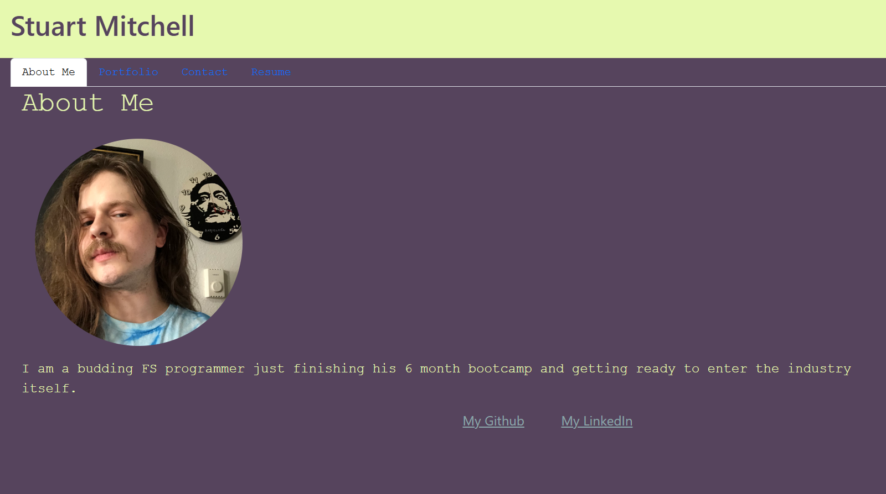

# My Portfolio

## Description

A simple portfolio of Stuart Mitchell to showcase his works.

## Table of Contents

- [Installation](#installation)
- [Usage](#usage)
- [License](#license)
- [Contributing](#contributing)
- [Tests](#tests)
- [Questions](#questions)

## Installation

Simply load the netlify link provided below.
https://smitchellportfolio.netlify.app/

## Usage

This app is intended for use by potential employers.

## License

This application is covered under the following license: https://opensource.org/licenses/MPL-2.0
---

## Contributing

## Questions

For any further questions, please contact me via one of the following methods:  
-GitHub Username: smitchell92   
-GitHub Link: [github.com/smitchell92](github.com/smitchell92)  
-Email Address: stuart.mitchell92@gmail.com   
-Deployed app: https://smitchellportfolio.netlify.app/  
-GitHub Repo: https://github.com/SMitchell92/My-Portfolio  